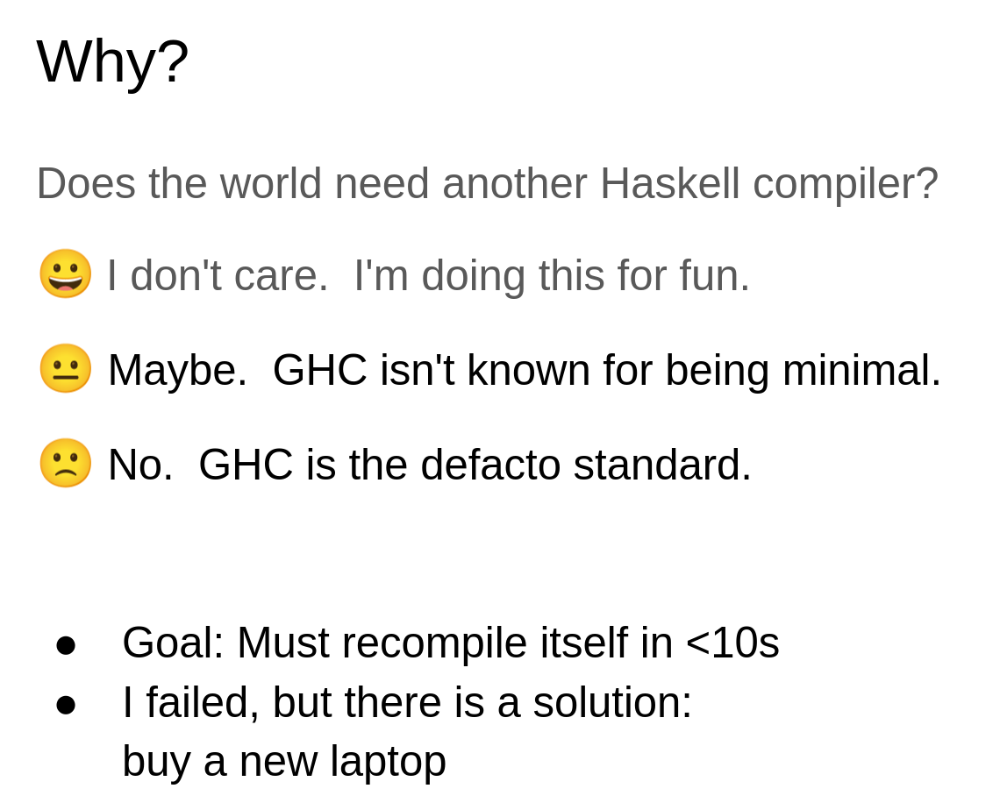

# HaskellOS: Bare-Metal Haskell on the Raspberry Pi 0

In short, I got a rough OS running with Haskell on the Pi 0, focusing mostly on the GPIO, UART, FAT32, Virtual Memory (Labs 2, 7, 16, 13/15/17), green threads via MicroHs's built-in `forkIO`/`MVar` concurrency, and NRF24L01+ wireless networking (lab 14). This is an outline of what design choices I had to make.

Roughly ~4.9k lines of Haskell, ~1,350 lines of C (plus third-party eval.c/emmc), ~310 lines of ASM, and we have an OS:

```
  _   _           _        _ _  ___  ____
 | | | | __ _ ___| | _____| | |/ _ \/ ___|
 | |_| |/ _` / __| |/ / _ \ | | | | \___ \
 |  _  | (_| \__ \   <  __/ | | |_| |___) |
 |_| |_|\__,_|___/_|\_\___|_|_|\___/|____/

Bare-metal Haskell OS for Raspberry Pi Zero
============================================
```


## Haskellian Lack Of History On Bare Metal

As far as I'm aware, there doesn't really exist a compiler for Haskell onto ARM bare-metal that I could find or understand. GHC itself [assumes](https://github.com/ghc/ghc/blob/master/rts/posix/OSMem.c) [a](https://github.com/ghc/ghc/blob/master/rts/sm/BlockAlloc.c) [lot](https://github.com/ghc/ghc/blob/master/rts/posix/Signals.c) [of](https://github.com/ghc/ghc/blob/master/rts/posix/OSThreads.c) [linux](https://github.com/ghc/ghc/blob/master/rts/Capability.c), which you can just find by checking for the usual suspects. Specifically:

```c
// OSMem.c uses mmap inside of this function
static void * my_mmap (void *addr, W_ size, int operation) {ret = mmap(addr, size, prot, flags, -1, 0);}
// BlockAlloc.c has a ton of functions that use mmap as well
void * getMBlocks(uint32_t n) 
// Signals.c uses memset/memcpy from libc
void initDefaultHandlers(void) {memset(&oact, 0, sizeof(struct sigaction));}
// OSThreads.c uses pthread_detach
int createOSThread (OSThreadId* pId, const char *name, OSThreadProc *startProc, void *param) {pthread_detach(*pId);}
// Capability.c uses OSThreads.c with pthreads as well
static Capability * waitForWorkerCapability (Task *task)
```

This being said, there do exist [cross-compilers onto ARM-linux](https://www.haskell.org/ghc/blog/20200515-ghc-on-arm.html). However, you'd still need to port all the run time support functions, which is more than a little bit annoying. I talked to Dawson about this, and he mentioned that I would need to turn off the garbage collector from GHC, which is mostly because it uses mmap to grow the heap. I did end up disabling it, though specifically because I didn't use GHC...

### Haskell Compilers Deep Dive

There were a few things I found while searching that would've been interesting projects in their own rights, though most of the support for these projects had been dropped:

- [UHC (Utrecht Haskell Compiler)](https://github.com/UU-ComputerScience/uhc) and more specifically [uhc-light](https://hackage.haskell.org/package/uhc-light). It has an LLVM backend which can compile down to ARM and also [foreign function support for javascript](https://utrechthaskellcompiler.wordpress.com/) and [c](https://github.com/UU-ComputerScience/uhc/blob/f2b94a90d26e2093d84044b3832a9a3e3c36b129/EHC/ehclib/uhcbase/Foreign/Ptr.hs#L130), but hasn't been touched since 2018.
- [Helium](https://github.com/Helium4Haskell/helium) is a compiler for Haskell that's meant to make it easier to teach, but it has no FFI support.
- [AJHC](https://hackage.haskell.org/package/ajhc) is a Haskell compiler that could run Haskell on Cortex-M3/bare-metal ARM, but its been abandoned and doesn't support anything past GHC 7.6.

And then we must approach the Galois in the room. They're a company that does a bunch of research into functional software analysis and have therefore had some interesting projects. However, they're more `adjacent' that don't actually give us Haskell:

- [Haskell Lightweight Virtual Machine (HaLVM)](https://github.com/GaloisInc/HaLVM) is a port of GHC to write virtual machines on the Xen hypervisor. I don't really need all that functionality but it's pretty sick. It took about 12 years before getting sunset...
- [Ivory](https://ivorylang.org/) is a embedded domain-specific language which is actually really interesting! However, you write metaprograms that output C, so you don't really get the Haskell-feel of Haskell (ADTs, pattern matching, IO monad), e.g. you get type-safety at codegen but not runtime. They have a ton of extensions for it like [Tower](https://ivorylang.org/tower-overview.html) which is their version of concurrency. 

So the only real candidate seems to be UHC/AJHC, but they both had their pitfalls.

### [MicroHS](https://hackage.haskell.org/package/MicroHs)

MicroHS is a ``small compiler'' for Haskell that only recently came out (2024) and still has recent development. Who made it? In comes the fucking goat, [Lennart Augustsson](https://en.wikipedia.org/wiki/Lennart_Augustsson). Here's an excerpt from [his slides](https://docs.google.com/presentation/d/1WsSiSwypNVTm0oZ3spRYF8gA59wyteOsIkPRjCUAZec/edit?slide=id.g2f3ec7d82da_0_57#slide=id.g2f3ec7d82da_0_57) on what I ended up using:



In complete honesty, I had no idea who Augustsson was before undertaking this project, and now I'm insanely impressed by him. Immediately throwing him on my GOAT list. So, what exactly is MicroHS? Very quickly, it's a compiler for Haskell into the SKI style combinators [via the $\lambda$-calculus](https://onlinelibrary.wiley.com/doi/abs/10.1002/spe.4380090105) in a very minimal way. Notably, it comes built in with a mark-sweep garbage collector (the simplest possible kind), and also allows us to use Haskell2010's ForeignFunctionInterface (it only does `foreign import ccall`, but we only ever wrote our code in c anyway, so it's fine). 


My rough understanding of what `mhs` lets us do is convert haskell into boundless combinators with a serialized AST defined by compositions of primitive combinators that are described in the paper. For FFI, it's able to generate marshalled wrappers for use: 

```hs
ccall "PUT32"
put32 :: Word32 -> Word32 -> IO ()
```

This now becomes:

```c
from_t mhs_PUT32(int s) {
    PUT32(mhs_to_Word(s, 0), mhs_to_Word(s, 1));
    return mhs_from_Unit(s, 2);
}
```

As for the main function, it converts `hs_main :: IO ()` into 

```c
void hs_main() {
    gc_check(4);
    ffe_push(xffe_table[0].ffe_value);  // push the combinator for hs_main
    (void)ffe_exec();                   // reduce it
    ffe_pop();
}
```

So while explicitly mhs converts Haskell into c code, which we later compile onto ARM bare-metal, this compiles Haskell into combinator data that can access C FFI. The actual evaluation is at runtime with the graph reducer/combinator interpreter. In some sense it's doing the work of [Hugs 98](https://www.haskell.org/hugs/), since they're both interpreters, but using that would've been too much Haskell for me. Using the combinator approach lets you have such a stupid simple runtime that it was the most attractive option.

## Rough Project Structure

Put very simply, there's a Haskell layer, which contains the core logic for everything. These functions call upon Hal.hs, which stores all of the FFI into c functions. The c functions are themselves wrappers around assembly primitives for things like mmio, barriers, and cache/TLB ops, and there are some rts stubs that I needed to get up as well.

The whole thing boots like this:

```
GPU loads kernel.img at 0x8000
  → boot.S: set supervisor mode, init stacks, jump to _cstart
  → cstart.c: zero BSS, init UART, init heap, call mhs_init(), call hs_main()
  → Main.hs: Haskell takes over, enables MMU, launches supervisor with heartbeat + shell children
```

### What Must Stay C/ASM

Not everything can or should be in Haskell. 

For ASM, I needed CP15 coprocessor operations, CPSR manipulation, MMIO access (`put32`/`get32`), boot sequence (CPU starts with no stack), EABI division.

For C, I needed the pre-runtime initialization (BSS zeroing, heap init, since it runs before MicroHs is initialized), EMMC/SD card driver, interrupt dispatch and ring buffers.

Finally I needed some stuff inside of `rts-stubs.c` since they're a libc replacement for eval.c. Specifically, `malloc` becomes the bump allocator, `write` works over UART, `signal`/`pthread` do nothing, `exit` does a reboot, plus string functions, printf, qsort, GCC builtins. I basically just asked claude to handle most of these, though, since I'm a bum and I don't know anything about c.

## Lab-by-Lab

I chose these labs mostly because they were the most interesting in my mind (playing around with a filesystem on the pi 0 was the highlight of the course for me) and Sai & James said that threading would be cool (though I ended up scrapping implementing threading myself).

### GPIO (Lab 2): Type-Safe Pins

The main motivation as to why you'd use Haskell for stuff like this is so you can encode hardware constraints into the type system itself instead of mandating that each function has a checker. For example, you could easily write/compile `gpio_set_output(20); gpio_read(20);` in c even though you'd be reading from an output pin. In Haskell, we can actually enforce this via types:

```haskell
newtype OutputPin = OutputPin Pin
newtype InputPin  = InputPin Pin

pinWrite :: OutputPin -> PinLevel -> IO ()
pinRead  :: InputPin  -> IO PinLevel
```

So now when you want to read/write, you literally need to type it correctly! This lets you write really simple programs like:

```haskell
pin <- outputPin 27  -- Configure pin 27 as output
pinWrite pin High    -- Turn on
delayMs 500
pinWrite pin Low     -- Turn off
```

### UART (Lab 7): Pattern Matching

The `getLine` function handles backspace, carriage return, and line feed through nested pattern matching, and is in my opinion more readable than the C equivalent with `if`/`else if` chains and manual buffer index management:

```haskell
getLine :: IO String
getLine = go []
  where
    go acc = do
        c <- getChar
        case c of
            '\n' -> do
                putChar '\n'
                return (reverse acc)
            '\DEL' -> case acc of
                [] -> go []
                (_:rest) -> do
                    putByte 0x08  -- move cursor back
                    putByte 0x20  -- overwrite with space
                    putByte 0x08  -- move cursor back again
                    go rest
            _ -> do
                putChar c  -- echo
                go (c : acc)
```

### Threads (Lab 5): Goofy Ahhh

MicroHS ships with a full green-thread scheduler inside `eval.c` so I used it to get background threads running alongside the shell!

You can see this when you check the `eval.c` code for `T_IO_FORK`, which creates an `mthread` with its own graph root, and Augustsson implemented synchronized mutable variables with blocking wait queues. Since we can also use `Control.Concurrent`, we are allowed `forkIO, threadDelay, yield, killThread` and also `Control.Concurrent.MVar` gives us `newMVar, takeMVar, putMVar, readMVar, swapMVar` for shared state.

The way `eval.c`'s scheduler works is really simple. It just runs an infinite loop pulling threads from the `runq`, giving each a fixed amount of reductions, and then when this is done it gets rotated out.

We get timer-preemptive threading at the Haskell level. Each thread gets a fixed number of reductions before being rotated out, and the ARM timer interrupt (10ms tick) now sets a `preempt_pending` flag that eval.c checks at every reduction step. When the flag is set, the current thread yields immediately regardless of its remaining slice, giving ~10ms preemption granularity. At the C level, longer calls with UART can still block all green threads, so between checks we call `yield`.

When a thread yields or blocks, `resched()` calls `longjmp(sched, mt_resched)` which jumps back to the scheduler loop in `start_exec()`. The thread's graph root (`mt_root`) is then saved so next time it runs, `evali(mt_root)` continues reduction from where it left off. No ARM register save/restore is then needed because all state lives in the heap graph.

Sleeping threads go into `timeq` (sorted by wake time). The scheduler checks `timeq` on every context switch and moves expired threads back to `runq`. Threads in `timeq` consume zero CPU. This is why the heartbeat uses `threadDelay` instead of `Timer.delayMs` as the the latter is a C-level busy-wait that blocks all green threads.

Finally `MVar a` is a mutable box that is either full or empty. `takeMVar` on an empty MVar blocks the thread (moves it to the MVar's wait queue). `putMVar` on a full MVar blocks. `readMVar` reads without emptying. This gives us safe shared state between threads without locks.

We don't have to worry about data races since MVar ops are atomic and the green-thread scheduler is cooperative (no mid-operation preemption), so IORefs/MVars are safe without locks.

Anyway, here's how we run the background thread for the board light during the shell:

```haskell
heartbeat :: GPIO.OutputPin -> MVar Bool -> IO ()
heartbeat pin activeVar = go
  where
    go = do
        active <- readMVar activeVar   -- non-destructive read
        if active
          then do
            GPIO.pinOn pin
            threadDelay 500000         -- 500ms, zero CPU (in timeq)
            GPIO.pinOff pin
            threadDelay 500000
          else
            threadDelay 1000000        -- idle poll
        go
```

And toggling from the shell is just:

```haskell
doHeartbeat var "on"  = do void $ swapMVar var True;  UART.putStrLn "Heartbeat ON"
doHeartbeat var "off" = do void $ swapMVar var False; UART.putStrLn "Heartbeat OFF"
```

Two things that MicroHS doesn't provide out of the box for bare metal:

For `threadDelay`, I needed to add `CLOCK_*` inside of `extra.c`, which wasn't too bad since it's just timer functions. Also, made it so that my `getChar` function was run via threads so the scheduler can run other threads while waiting for keyboard input.

### Interrupts (Labs 4/8): Hardware-Driven I/O

With green threads working, the next step was replacing polling with real ARM hardware interrupts. Now there are two interrupt sources with an ARM timer (100Hz periodic tick) and UART RX (incoming bytes buffered by the IRQ handler instead of polled).

I originally just wrote `getChar` which polled `c_uart_has_data` in a loop. Now incoming UART bytes are caught by the IRQ handler and stored in a 256-byte ring buffer in C. `getChar` checks the ring buffer first (a fast FFI call), and only falls back to polling if the buffer is empty (for the brief period before interrupts are enabled at boot).

The timer interrupt ticks at 100Hz, incrementing a counter that the `uptime` shell command reads.

The IRQ handler must only ever touch its own state w/ the tick counter + ring buffer as it must not call into the MHS evaluator, since we dont want to corrupt the evaluators global state.

The `Interrupt.hs` module provides type-safe wrappers:

```haskell
initTimerInterrupt :: Word32 -> IO ()  -- period in microseconds
initUartInterrupt  :: IO ()            -- enable UART RX interrupt
timerTicks         :: IO Word32        -- read tick counter
uartRxHasData      :: IO Bool          -- check ring buffer
uartRxRead         :: IO (Maybe Word8) -- read from ring buffer
```

And the `uptime` shell command demonstrates it:

```haskell
doUptime = do
    ticks <- Interrupt.timerTicks
    let secs = ticks `div` 100   -- 100Hz timer
    let mins = secs `div` 60
    ...
```

So interrupt bottom-half fills buffers, userspace reads them. We're doing it with green threads instead of processes, and MVars instead of file descriptors, but the architecture is the same.

### FAT32 (Lab 16): FILE ON THE SYSTEM BABY

FAT32 is fundamentally about data structure traversal, which is extraordinarily nice to do in Haskell! Specifically, stuff like Master Boot Record parsing, BPB field extraction, FAT chain following, directory entry scanning.

Most of it was just copying over `emmc.c` and `sd.c` and then just writing the rest needed in Haskell. Most of it isn't interesting because it's just the same as the lab, but with `do` chaining everything together. 

Remember that FAT32 works by storing:

```
Sector 0:        MBR (Master Boot Record)    says "partition 1 starts at sector X"
Sector X:        BPB (BIOS Parameter Block)  filesystem metadata
Sectors X+R:     FAT (File Allocation Table) the "linked list" of where file data lives
Sectors X+R+F:   Data region                 actual file contents, divided into clusters
```

So to actually get data, we need to follow the linked list. Cluster chaining travels across the FAT clusters looks like a very simple linked list traversal:

```haskell
followChain :: FAT32FS -> Word32 -> IO [Word32]
followChain fs startCluster = go startCluster []
  where
    go cluster acc
      | not (isValidCluster cluster) = return (reverse acc)
      | otherwise = do
          next <- readFATEntry fs cluster
          go next (cluster : acc)
```

We want to search the filesystem without necessarily reading everything. In c, we'd probably have to write some nested loops with a break/return, but Haskell lets us write a `firstJustM` combinator for short-circuiting directory search across clusters:

```haskell
firstJustM :: [a] -> (a -> IO (Maybe b)) -> IO (Maybe b)
firstJustM []     _ = return Nothing
firstJustM (x:xs) f = do
    result <- f x
    case result of
      Just r  -> return (Just r)
      Nothing -> firstJustM xs f
```

### Virtual Memory (Labs 13/15/17)

The VM module encodes ARMv6 page table semantics as Haskell ADTs:

```haskell
data AccessPerm  = APNoAccess | APPrivOnly | APUserRO | APFullAccess
data CachePolicy = Uncached | WriteThrough | WriteBack

data PageTableEntry = PTE
  { ptePA      :: !Word32       -- Physical address (1MB aligned)
  , pteAP      :: !AccessPerm
  , pteDomain  :: !Word8        -- Domain 0-15
  , pteCache   :: !CachePolicy
  , pteExecute :: !Bool         -- XN bit (False = executable)
  }
```

In the c implementation, page table entries are raw bit manips with magic numbers, but in Haskell we can just write some code that force it so that invalid combinations can't be represented:

```haskell
encodePTE :: PageTableEntry -> Word32
encodePTE pte =
    (ptePA pte .&. 0xFFF00000)                     -- Base [31:20]
    .|. (apToBits (pteAP pte) `shiftL` 10)         -- AP [11:10]
    .|. (fromIntegral (pteDomain pte) `shiftL` 5)  -- Domain [8:5]
    .|. (cBit `shiftL` 3) .|. (bBit `shiftL` 2)    -- C,B [3:2]
    .|. (xnBit `shiftL` 4)                         -- XN [4]
    .|. 0x2                                        -- Section type [1:0]
```

The nice part is that you can define memory regions as data and then map them. For example, the kernel needs three regions, code (cached, privileged), heap (cached, full access), and device registers (uncached, no caching because MMIO is side-effecting):

```haskell
kernelCodeRegion = MemRegion 0x0 0x0 sectionSize APPrivOnly 0 WriteBack
kernelHeapRegion = MemRegion sectionSize sectionSize (127 * sectionSize) APFullAccess 0 WriteBack
deviceRegion     = MemRegion 0x20000000 0x20000000 (16 * sectionSize) APPrivOnly 0 Uncached
```

The MMU is enabled permanently during boot (`Main.hs` calls `VM.initMMU`). All kernel regions (code, heap, stack, IRQ stack, MicroHs heap (200MB at 0x0A000000), and device registers) are identity-mapped. Domain 0 uses `DomainClient` mode, enforcing the AP bits in each section descriptor. The `vm` shell command shows MMU status and verifies device access works under translation. The actual CP15 coprocessor operations (set TTBR0, invalidate TLB, enable/disable MMU) stay in assembly since they require `mcr`/`mrc` instructions, and Haskell calls them through FFI.

`setDomainAccess` does a read-modify-write on the DACR: read via `mrc p15`, mask out the 2-bit field for the domain, OR in the new bits.

### NRF Wireless (Lab 14): Typed Radio & Message Passing

The NRF24L01+ is a 2.4GHz radio that talks over SPI, and the Pi has two of them on different chip selects (left on CE=6/SPI=0, right on CE=5/SPI=1). You can use Haskell to store configs pretty simply:

```haskell
data NrfConfig = NrfConfig
  { nrfChannel   :: Word8      -- RF channel 0-125
  , nrfDataRate  :: DataRate   -- NRF1Mbps | NRF2Mbps | NRF250Kbps
  , nrfPower     :: PowerLevel -- DBmMinus18 | DBmMinus12 | DBmMinus6 | DBm0
  , nrfCePin     :: Word32     -- CE GPIO pin
  , nrfSpiChip   :: Word32     -- SPI chip select (0 or 1)
  , nrfRxAddr    :: Word32     -- receive address
  , nrfTxAddr    :: Word32     -- transmit address
  , nrfAcked     :: Bool       -- hardware auto-ACK
  , ...
  }
```

Setting up two NRFs for loopback is just record updates from a default:

```haskell
serverConfig = defaultConfig { nrfCePin = 6, nrfSpiChip = 0, nrfRxAddr = 0xd5d5d5, nrfTxAddr = 0xe5e5e5 }
clientConfig = defaultConfig { nrfCePin = 5, nrfSpiChip = 1, nrfRxAddr = 0xe5e5e5, nrfTxAddr = 0xd5d5d5 }
```

The NRF state machine (PowerDown -> StandbyI -> RxMode <-> TxMode) is an ADT instead of raw ints, and `NrfHandle` uses IORefs for mutable counters (sent/received/retransmitted/lost). Since MicroHs's scheduler is cooperative, all the threads (heartbeat, shell, NRF) can just share IORefs without locks.

`nrfSend` does reliable transmission with exponential backoff: load payload, enter TX mode, poll for TX_DS or MAX_RT. On MAX_RT it clears the interrupt, flushes the FIFO, backs off (500μs × 2^attempt + jitter), and retries up to 7 times before giving up. Stats are tracked in IORefs.

The SPI driver itself (`SPI.hs`) is a thin wrapper over C. On top of the raw NRF byte send/recv, we built two layers that are actually more Haskell.

`Process.hs` implements Erlang-style typed channels and process supervision (https://www.erlang.org/docs/24/design_principles/sup_princ):

```haskell
data Chan a  -- typed, unbounded, thread-safe channel

send   :: Chan a -> a -> IO ()
recv   :: Chan a -> IO a
select :: [Chan a] -> IO (Int, a)  -- wait on first available (1ms backoff)

data RestartPolicy = Permanent | Temporary
supervisor :: [ChildSpec] -> IO ()  -- Erlang-style supervisor
```

The supervisor is now live, and `hs_main` launches both the heartbeat and shell as `Permanent` children. If the shell returns (e.g., a future `exit` command), the supervisor restarts it. Without try/catch in MicroHs, a thread crash in the reducer kills the thread silently (state stays `Running`), so crash recovery isn't possible, but clean exits are handled correctly. `Transient` and `Failed` were removed since they're unreachable without exception support.

The `Chan a` is parameterized, so you literally cannot send a `String` on a `Chan Int`. `NetChan.hs` bridges these typed channels with the NRF radio via a `Msg` ADT:

```haskell
data Msg
  = MsgInt Int          -- tag 0x01
  | MsgStr String       -- tag 0x02
  | MsgWord Word32      -- tag 0x03
  | MsgBytes [Word8]    -- tag 0x04
  | MsgPair Msg Msg     -- tag 0x05
  | MsgTag String Msg   -- tag 0x06
  | MsgNone             -- tag 0x00
```

To add a new message type you just add a constructor and two pattern match cases (encode + decode). The send thread warns over UART if a message overflows the 32-byte NRF payload. The `NetChan` type spawns background green threads (using the same `forkIO` as the heartbeat) to bridge a typed channel with the NRF radio:

```haskell
openNetChan :: NRF.NrfHandle -> IO NetChan
netSend     :: NetChan -> Msg -> IO ()
netRecv     :: NetChan -> IO Msg
```

So you can send typed Haskell values wirelessly between two Pis and pattern match on what you receive. That's pretty sick.

I used claude to adapt the loopback tests. The `test-nrf` target (`make test-nrf`) builds a standalone loopback test that inits both NRFs on one Pi and sends packets between them: server sends to client's address, client reads from its FIFO. It tests SPI register access, no-ack send, ACK send with retransmit, and NetChan encode/decode through the actual radio.

There are also tests for the process system (`make test-process`), VM (`make test-vm`), interrupts (`make test-interrupt`), and the shell (`make test-shell`).

### Parser Combinators + Lisp Interpreter: Three Layers of Abstraction

This is the non-lab part of the project, but specifically a very Haskell part of the project. Roughly, I just thought it wouldn't be too hard to get a lisp interpreter working via haskell on bare metal. (Inspiration: https://www.jemoka.com/posts/kbhlisp/)


To do this, I needed a parser combinator library (`Parse.hs`) and a Lisp interpreter (`Lisp.hs`) that uses it to parse S-expressions.

Also I took CS242 and felt like I didn't get that much out of the class and I wanted to challenge myself to "daniel-mode" it.

#### Parser Combinators (Parse.hs)

The parser combinator library has the core type is:

```haskell
newtype Parser a = Parser { runParser :: String -> Maybe (a, String) }
```

A parser is a function that takes a string and maybe returns a result plus the unconsumed remainder. Haskell gives us four typeclass instances, Functor, Applicative, Monad, and Alternative, which give us the full vocabulary of parser composition:

```haskell
instance Functor Parser where ...     -- fmap: transform results
instance Applicative Parser where ... -- <*>: sequence parsers
instance Monad Parser where ...       -- >>=: chain with dependencies
instance Alternative Parser where ... -- <|>: try alternatives, many: repetition
```

This lets you write out really simple parsers that look more like dealing with cfgs:

```haskell
parseExpr :: Parser LispVal
parseExpr = parseNumber <|> parseBool <|> parseString
        <|> parseQuote <|> parseList <|> parseAtom
```

Each alternative is tried in order; `<|>` backtracks on failure. `many` and `sepBy` handle repetition. `between` handles delimiters. The library also includes `spaces1`, `word`, and `rest` for tokenizing shell input. 

#### Lisp Interpreter (Lisp.hs)

Core data type:

```haskell
data LispVal
  = Atom String                                              -- symbol
  | Number Int                                               -- integer
  | Bool Bool                                                -- #t / #f
  | Str String                                               -- "string"
  | List [LispVal]                                           -- (a b c)
  | Func String ([LispVal] -> IO (Either String LispVal))    -- built-in
  | Closure [String] LispVal Env                             -- lambda
  | Nil
```

The evaluator is now just pure pattern matching:

```haskell
eval env (Number n)  = return (Right (Number n))              -- self-evaluating
eval env (Atom name) = ...                                    -- variable lookup
eval env (List [Atom "quote", val]) = ...                     -- quote
eval env (List [Atom "if", cond, conseq, alt]) = ...          -- if
eval env (List [Atom "define", Atom name, expr]) = ...        -- define
eval env (List [Atom "lambda", List params, body]) = ...      -- lambda
eval env (List (func : args)) = ...                           -- function application
```

I got sick of writing `case result of Left err -> return (Left err); Right val -> ...` in every eval clause, so `bindE` chains `IO (Either String a)` computations (basically a poor man's `ExceptT`):

```haskell
eval env (List (func : args)) =
    eval env func `bindE` \f ->
        evalArgs env args `bindE` \argVals ->
            apply f argVals
```

Closures capture the env in an MVar. Recursive functions work because `define` mutates the MVar after creating the closure, so by the time you call it, the binding is there.

#### Hardware FFI

Note that the lisp code can directly control Pi hardware through built-in functions:

```lisp
lisp> (define (blink n) (if (= n 0) (quote done) (begin (gpio-write 27 1) (delay 500) (gpio-write 27 0) (delay 500) (blink (- n 1)))))
lisp> (blink 3)
done
```

The hardware functions (`gpio-write`, `gpio-read`, `delay`, `uart-print`) are just `Func` values wrapping IO actions. So lisp code goes through three layers: Lisp → Haskell evaluator → C FFI → ARM hardware.

Files can also be run from the SD card: `lisp run BLINK.LSP`. The parser handles multiple top-level expressions, so a file can contain several `define`s followed by a call. FAT32 filenames are 8.3 uppercase (e.g. `BLINK.LSP`, `FACT.LSP`).


## Setbacks

There were a ton of setbacks that were roughly of the form "oh, I need more c for this than I expected..."

The simplest one was that my baud rate was wrong post overclocking my pi. That wasn't too bad to fix since I just had to update it.

ARM1176JZF-S has no native hardware division, so I had a ton of bugs around this for a while, so just had to write `__aeabi_idivmod`, and so everything in c uses just normal mod but in assembly its a different calling convention.

C/ASM wouldn't link without Haskell because `cstart.c` calls `hs_main()`, so I had to use `__attribute__((weak))` so it could link and we can override it later. 

The native way that mhs eval.c works is that it uses `__builtin_popcount` and `__builtin_ctz`, which GCC compiles to libgcc calls on ARM, so I had to fixed it by using claude to get the appropriate functions in `rts-stubs.c`. Also, eval.c uses `setjmp` and `longjmp` for the internal scheduler, so I had to link against newlib's `libc.a`, and claude helped there too.

The biggest issue was that the GC kept following NULL into exception vectors, which was nasty. On Linux, dereferencing address 0x0 causes a segfault, so the kernel leaves that page unmapped, and upstream eval.c's `mark()` function doesn't bother guarding against NULL pointers. But on the Pi, address 0x0 is the exception vector table as `boot.S` copies valid branch instructions there. So when the GC accidentally follows a stale pointer to 0, it doesn't crash, but it reads the vector table bytes, interprets them as combinator node tags, and corrupts the heap. I had to add bound checks in `mark()`, which would bail out if the pointer is NIL, below the heap, or above the heap. This gave me almost a full night of annoyances. 

```c
/* address 0 has exception vectors, not an unmapped page.
* Must guard against NULL/out-of-range before dereferencing. */
if (n == NIL || n < cells || n > cells + heap_size)
    return;
```

Further, how do you mount the SD card to use a filesystem? The lab 16 `emmc.c` assumed it was the first thing to touch the SD card, but on bare metal the GPU already used the card to load `kernel.img`, so the EMMC controller was in a dirty state when our code started running. The symptom was garbled/shifted data coming back from sector reads. I ended up shotgunning a bunch of fixes, clearing stale interrupt flags before every command, retrying CMD0 since the card was still in whatever state the GPU left it in, removing the CMD5/SDIO check that was poisoning the controller on regular SD cards, adding delays between init steps, and configuring pin 53 (SD_DATA3) which the original driver was missing. Not totally sure what fixed it in the end, I'm pretty sure it was an off by one error somewhere.

FAT32 was also a bit fucked. The fundamental issue is that Haskell has no pointers and no byte-level memory access, but FAT32 is all about reading structured data at arbitrary byte offsets in raw sector buffers. The only memory primitive we have from the FFI is `PUT32`/`GET32` (32-bit aligned reads/writes via assembly), so every byte access had to go through:

```haskell
peek8 buf off = do
    w <- peek32 (buf + (off .&. 0xFFFFFFFC))  -- round down to aligned address
    let byteOff = off .&. 3                   -- which byte within the word
    return (fromIntegral ((w `shiftR` fromIntegral (byteOff * 8)) .&. 0xFF))
```

Writing a single byte is even uglier, as you have to read the aligned word, mask out the old byte, OR in the new one, write it back:

```haskell
poke8 buf off val = do
    let aligned = buf + (off .&. 0xFFFFFFFC)
    old <- peek32 aligned
    let mask = complement (0xFF `shiftL` shiftAmt)
    let new_ = (old .&. mask) .|. (fromIntegral val `shiftL` shiftAmt)
    poke32 aligned new_
```

In C this is just `buf[off] = val`. It's literally 3 words! But in Haskell you need to do a ton more bit manipulation with more calls than is probably healthy. Similarly, `copyBytes` copies one byte at a time through the whole peek8/poke8 dance. For a 512-byte sector that's 512 iterations of aligned-read-shift-mask-aligned-read-mask-shift-aligned-write. In C it's one `memcpy`.


Making the MMU permanent exposed two off-by-one-style mapping bugs that both caused silent data aborts (hangs with no error message, since bare metal has no abort handler). First, the kmalloc heap grows from `__heap_start__` (right after BSS, ~0x4C000) upward by 200MB, crossing through a 16MB gap between `irqStackRegion` (ended at 0x09000000) and `mhsHeapRegion` (started at 0x0A000000). Any allocation landing in that gap faulted. Second, the original `deviceRegion` mapped only 3MB of BCM2835 peripherals (0x20000000-0x202FFFFF), but the EMMC/SD card controller lives at 0x20300000, literally one byte past the mapped boundary! Every `ls` or `cat` command tried to read an unmapped MMIO register and hung. Both were fixed by extending the regions, but they were nasty to debug because the symptom was just "it stops" with no output.

## Thoughts

The kernel is tiny (<300 KB) but that makes sense since this doesn't really do anything big. It has a very simple shell with 18 commands (`ls, cat, touch, write, rm, mv, blink, echo, timer, gpio, info, vm, heartbeat, uptime, nrf, lisp, help, reboot`). 

I dunno. My take is that there's a tradeoff between the niceity of your logic and the practicality of your low level code. As a way of showing this, here's examples of beautiful and ugly haskell from the project:

### Beautiful Haskell

Point-free code is inherently beautiful in the algebraic sense, because you just remove everything you don't need. There's a few spaces in the code this is used, especially inside of FAT32 when dealing with filenames. Similarly, having access to infinite lists is always nice.

```haskell
trimSpaces = reverse . dropWhile (== ' ') . reverse
padRight n s = map charToByte (take n (s ++ repeat ' '))
```

More monadically, we can `mapM` over a range to read bytes as characters. In C this is a for loop with an index and a buffer, but we natively have it as a one liner for a `String`:

```haskell
name <- mapM readChar [0..7]
ext  <- mapM readChar [8..10]
```

It's really easy to write infinite loops:

```haskell
blinkForever pin = do
    GPIO.pinOn pin
    Timer.delayMs 500
    GPIO.pinOff pin
    Timer.delayMs 500
    blinkForever pin
```

The Maybe monad makes error handling really easy:

```haskell
mfs <- FAT32.mountFS
case mfs of
    Nothing -> UART.putStrLn "FAILED: Could not mount filesystem"
    Just fs -> do
        entries <- FAT32.listRoot fs
        mapM_ FAT32.printDirEntry entries
```

Control flow is very chill:

```haskell
writeDataChain :: FAT32FS -> Word32 -> Ptr -> Word32 -> Word32 -> IO ()
writeDataChain fs startCluster dataPtr dataSize bytesPerCluster =
    go startCluster dataPtr dataSize 0
  where
    go cluster dPtr remaining prevCluster
      | remaining == 0 = cleanupTail cluster prevCluster
      | otherwise = ...
    cleanupTail cluster prevCluster = ...
    finalizeCluster cluster nextEntry = ...
    advanceChain cluster nextEntry dPtr remaining
      | isValidCluster nextEntry = go nextEntry dPtr remaining cluster
      | otherwise = ...  -- allocate new cluster
```

The typeclass tower for the parser is probably my favorite part of the codebase. Four instances, each like 3-5 lines:

```haskell
newtype Parser a = Parser { runParser :: String -> Maybe (a, String) }

instance Functor Parser where
  fmap f (Parser p) = Parser $ \s -> case p s of
    Nothing      -> Nothing
    Just (a, s') -> Just (f a, s')

instance Applicative Parser where
  pure a = Parser $ \s -> Just (a, s)
  (Parser pf) <*> (Parser pa) = Parser $ \s -> case pf s of
    Nothing      -> Nothing
    Just (f, s') -> case pa s' of
      Nothing       -> Nothing
      Just (a, s'') -> Just (f a, s'')

instance Monad Parser where
  return = pure
  (Parser pa) >>= f = Parser $ \s -> case pa s of
    Nothing      -> Nothing
    Just (a, s') -> runParser (f a) s'

instance Alternative Parser where
  empty = Parser $ const Nothing
  (Parser p1) <|> (Parser p2) = Parser $ \s ->
    case p1 s of
      Just r  -> Just r
      Nothing -> p2 s
```

And then all the combinators are just one-liners from there:

```haskell
many1 p          = (:) <$> p <*> many p
choice           = asum
sepBy1 p sep     = (:) <$> p <*> many (sep >> p)
between open close p = open *> p <* close
optional p       = (Just <$> p) <|> pure Nothing
```

`netSend` and `netRecv` are literally one-liners wrapping the channel:

```haskell
netSend :: NetChan -> Msg -> IO ()
netSend nc = send (ncOutbox nc)

netRecv :: NetChan -> IO Msg
netRecv nc = recv (ncInbox nc)
```

The supervisor is basically just `mapM` + pattern matching on whether to restart:

```haskell
supervisor :: [ChildSpec] -> IO ()
supervisor specs = do
    handles <- mapM spawnChild specs
    monitorLoop (zip specs handles)
  where
    spawnChild spec = do
        UART.putStr "  Starting: "
        UART.putStrLn (csName spec)
        spawn (csName spec) (csAction spec)

    monitorLoop children = do
        threadDelay 100000
        children' <- mapM checkChild children
        monitorLoop children'

    checkChild (spec, handle) = do
        st <- readMVar (procState handle)
        case st of
          Running -> return (spec, handle)
          Done -> case csPolicy spec of
              Permanent -> restart spec
              Temporary -> return (spec, handle)

    restart spec = do
        UART.putStr "Supervisor: Restarting "
        UART.putStrLn (csName spec)
        h <- spawnChild spec
        return (spec, h)
```

We can generalize the comparisons when handling lisp:

```haskell
mkCmp :: String -> (Int -> Int -> Bool) -> [LispVal] -> IO (Either String LispVal)
mkCmp _   op [Number a, Number b] = return (Right (Bool (op a b)))
mkCmp sym _  _                    = return (Left (sym ++ ": expected two numbers"))

-- in defaultEnv:
("<",  Func "<"  (mkCmp "<"  (<)))
(">",  Func ">"  (mkCmp ">"  (>)))
("<=", Func "<=" (mkCmp "<=" (<=)))
(">=", Func ">=" (mkCmp ">=" (>=)))
```

### Ugly Haskell

The nested `case` staircase of doom I used to have in `createFile` was the most visually offensive code in the project. GHC Haskell solves this with `MaybeT` monad transformers, but MicroHs doesn't have those. So I built a lightweight `MaybeIO` (25 lines) inline in `FAT32.hs`:

```haskell
-- before: 3 levels of nested case, 23 lines of staircase
-- after: flat monadic chain with MaybeIO
createFile :: FAT32FS -> Word32 -> String -> IO (Maybe DirEntry)
createFile fs dirCluster name = runMaybeIO $ do
    sfnBytes <- errOnNothing "ERROR: Invalid 8.3 filename" (formatSFN name)
    existing <- liftIO (findEntry fs dirCluster name)
    errWhen (isJust existing) "ERROR: File already exists"
    (slotLBA, slotOffset) <- errOnNothingIO "ERROR: No free directory entry"
                                 (findFreeDirSlot fs dirCluster)
    liftIO $ do
        readSector (fsWriteBuf fs) slotLBA
        writeDirEntryRaw (fsWriteBuf fs) slotOffset sfnBytes 0x20 0 0
        writeSector (fsWriteBuf fs) slotLBA
    return (DirEntry (map toUpper name) 0 0 False False)
```

And of course `poke8` / `peek8` being the bit manipulation that wishes it were C. This is fundamentally imperative code that gains nothing from being in Haskell. In C it's `buf[off] = val`:

```haskell
poke8 buf off val = do
    let aligned = buf + (off .&. 0xFFFFFFFC)
    let byteOff = off .&. 3
    let shiftAmt = fromIntegral (byteOff * 8)
    old <- peek32 aligned
    let mask = complement (0xFF `shiftL` shiftAmt)
    let new_ = (old .&. mask) .|. (fromIntegral val `shiftL` shiftAmt)
    poke32 aligned new_
```

`findDirEntrySlot` has like three levels of nested `do` clauses and it's hard to follow:

```haskell
findDirEntrySlot :: FAT32FS -> Word32 -> String -> IO (Maybe (Word32, Word32, DirEntry))
findDirEntrySlot fs dirCluster targetName = do
    clusters <- followChain fs dirCluster
    firstJustM clusters searchCluster
  where
    searchCluster c = do
        let baseLBA = clusterToLBA fs c
        firstJustM [0 .. secsPerClus - 1] $ \secIdx -> do
            let lba = baseLBA + secIdx
            readSector buf lba
            scanEntries lba 0

    scanEntries _ off | off >= sectorSize = return Nothing
    scanEntries lba off = do
        firstByte <- peek8 buf off
        case firstByte of
          0x00 -> return Nothing
          0xE5 -> scanEntries lba (off + 32)
          _    -> do
            attr <- peek8 buf (off + 11)
            if attr == 0x0F
              then scanEntries lba (off + 32)
              else do
                name <- parseSFN buf off
                if map toUpper name == upperTarget
                  then do
                    mEntry <- parseDirEntry buf off
                    case mEntry of
                      Just entry -> return (Just (lba, off, entry))
                      Nothing    -> scanEntries lba (off + 32)
                  else scanEntries lba (off + 32)
```

### The pattern

The beautiful stuff is always the logic layer via parsing, pattern matching, typeclasses. The ugly stuff is always the plumbing with byte access, error handling without monad transformers, imperative sequences that are really just C in disguise.

Haskell is great for data structures and type safety but fighting it for raw memory access is painful. Logic in Haskell, bytes in C, FFI as the bridge.


BTW if you want to have fun do `strings` on the `kernel.img`, you can see all the combinators!